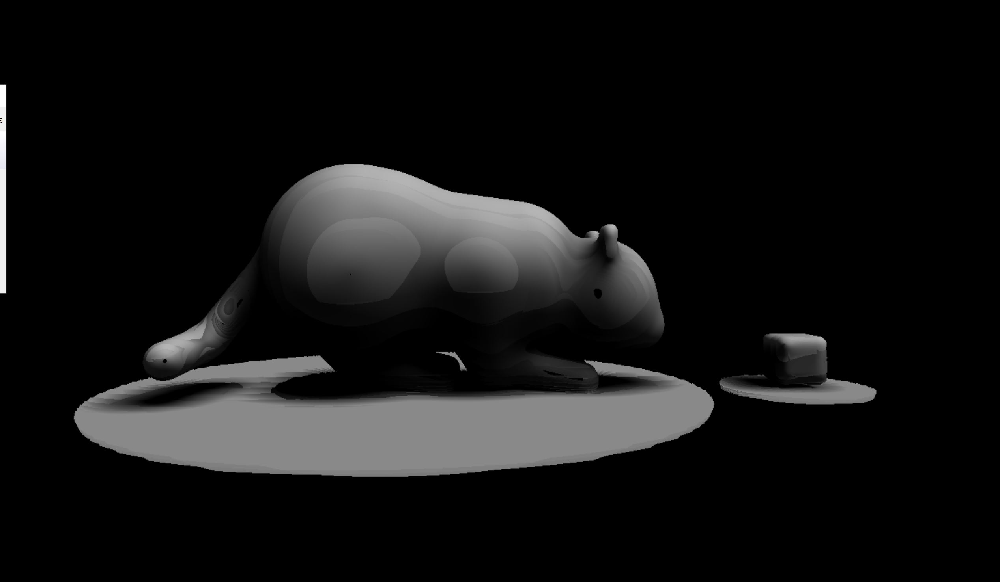
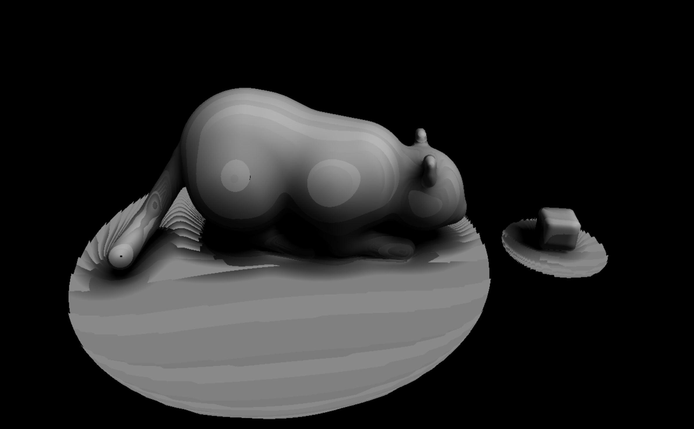
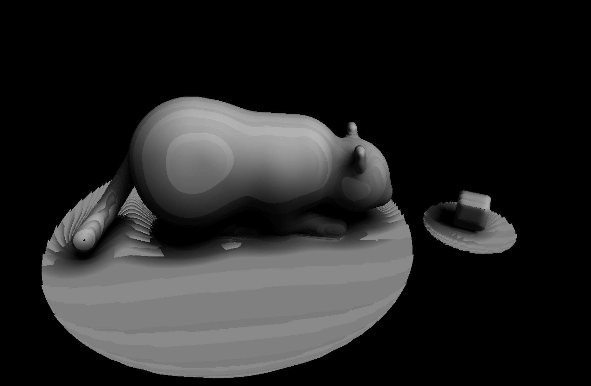

##submission
Name: Effie Li
Pennkey:effieli
Citation: https://www.iquilezles.org/www/articles/distfunctions/distfunctions.htm
Link: https://effieyanfei.github.io/hw02-raymarching-sdfs/

I created a ready-to-bounce cat wiggling its butt at a animated box. The cat is created with a combination of shapes including sphere, cone and capsule. I used both sin and cos, as well as triangle wave to animate the cat. The cat's butt and thighs move side to side, and slightly up and down. The box is created with a box sdf, and it is animated using sin and a parabola funtion. 
Here are two images showing the movement:

