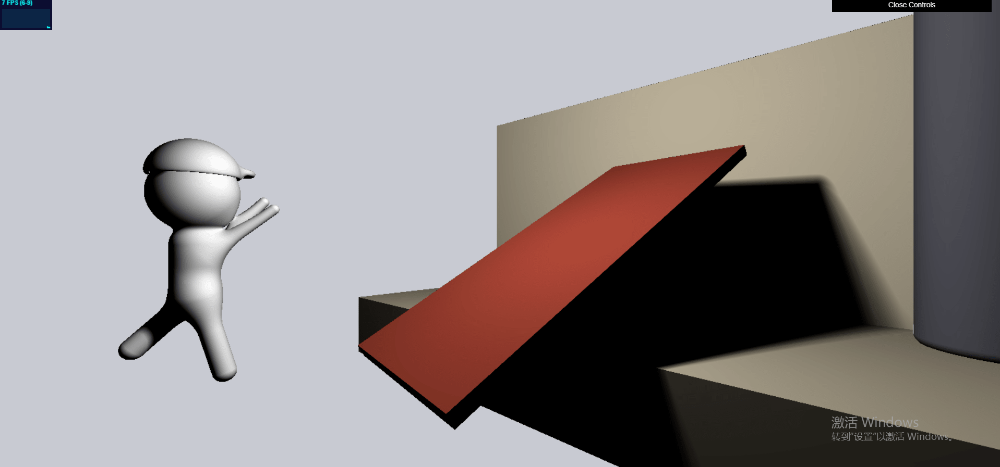
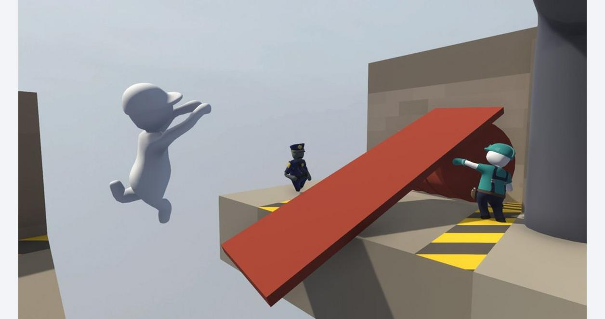

Name: Haowei Li\
Pennkey: lihaowei

## Live Demo
https://hli605.github.io/hw02-raymarching-sdfs/

## External Resources
https://www.iquilezles.org/www/articles/distfunctions/distfunctions.htm

## Techniques used
- I used Smooth Blend Subtraction in modeling the cap of the character.
- I used Smooth Blend Union in modeling the other parts of the character.
- I used bias and sin toolbox functions to rotate the bridge back and forth over time.

## Pictures
Screenshot

Reference Image

