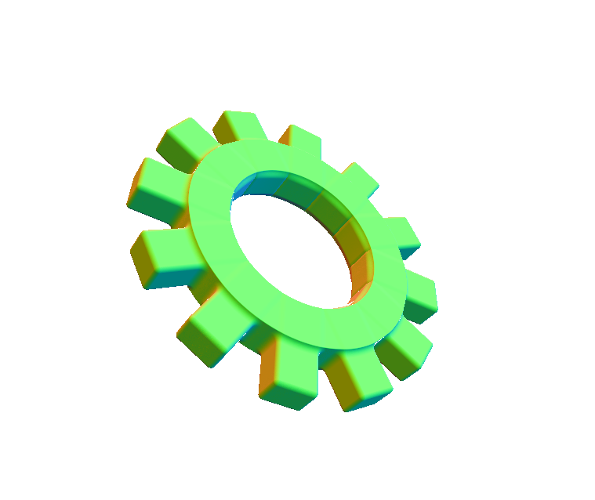
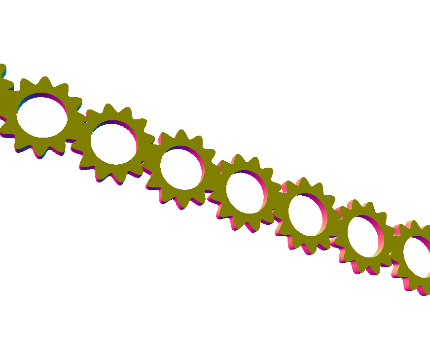

# CIS 566 Homework 2: Implicit Surfaces

## Info
- Lanqing Bao (lanqing)
- Link:  https://seiseiko.github.io/hw02-raymarching-sdfs/ (NOT WORKING)
## Screenshots


(I'm having some issue of apply different rotation along Z. Still trying to fix it ;o;)
## Implementation Details

- Gear: I created gearSDF using box & ring at the first place. But it is hardly satisfying when I tried to generate infinite scene. It's hard to match box-shape teeth after rotation. Thus I switched to sinwave. 



- Scene Generation: A row of gears is generated by two halves of gear & a compelete one. Since gears have overlapping at the boundary teeth, I perform modular at the center point instead of boundary ```mod(p.x,size)-size/2.;```. Then rows of gears are created along z-axis and rotated based on their z-position.

- Light: Hard shadow, lambertian plus blinn phong. Two light source. 

## Citation and resources

- [IQ's Article on SDFs](http://www.iquilezles.org/www/articles/distfunctions/distfunctions.htm)
- [IQ's Article on Smooth Blending](http://www.iquilezles.org/www/articles/smin/smin.htm)
- [Breakdown of Rendering an SDF Scene](http://www.iquilezles.org/www/material/nvscene2008/rwwtt.pdf)

