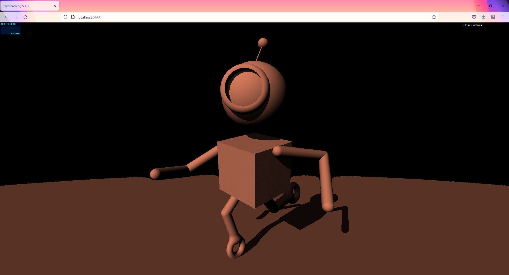
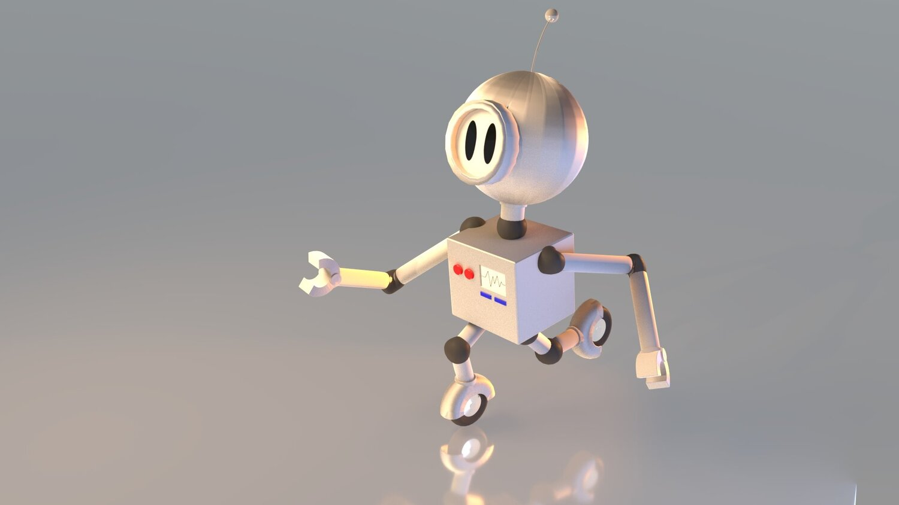

# RayMarching SDFs

## Nathan Devlin - @ndevlin - ndevlin@seas.upenn.edu - www.ndevlin.com

Result:

Reference Image:

## Live Demo
View a live WebGL Demo here!:
https://ndevlin.github.io/hw02-raymarching-sdfs/

## Project Description

This project uses Signed Distance Functions (as opposed to explicit geometry) to define a scene. Ray marching is used to determine pixel colors. The project uses WebGL and was coded with TypeScript and GLSL in Visual Studio Code.

## Implementation Details

This scene is created entirely in the fragment shader. Rays are shot from the camera through the pixels of the screen to test against the sdfs that comprise the scene to determine distance of the nearest object to the camera. The scene is composed of primitives that have been combined together in various ways; for example a smooth blend operation is used to nicely blend together the toruses that compose the robot's feet/wheels with the capsule primitives that compose his lower legs. 

The primitives are described by SDF functions at the top of the shader. Normals are calculated by sampling the scene in the same way, using small epsilon differences from the sampled fragment to determine the normal. These normals are then used to achieve lambertian shading by comparing the normal to the light position. To enhance the lighting, a shadow effect is created whereby a shadow feeler ray is sent from the camera ray's intersection point towards the light source to determine if there is an occlusion. 

There is also some simple animation added to the scene. The face of the robot, which looks sort of like an old-school scuba mask is created with a boolean subtraction operation between one rounded cylinder and a smaller one. This is added to the sphere that composes the head with a Union operation to meld them together. This face is animated using rotation operations and a quadratic Impulse function combined with a sin function to create the effect that the robot abruptly looks at the camera, then slowly looks away again. Additionally, the antenna ball on his head is animated using cosin functions to give the feeling that it is bouncing around playfully. 

IQ's article on SDF shapes was very useful:
https://www.iquilezles.org/www/articles/distfunctions/distfunctions.htm