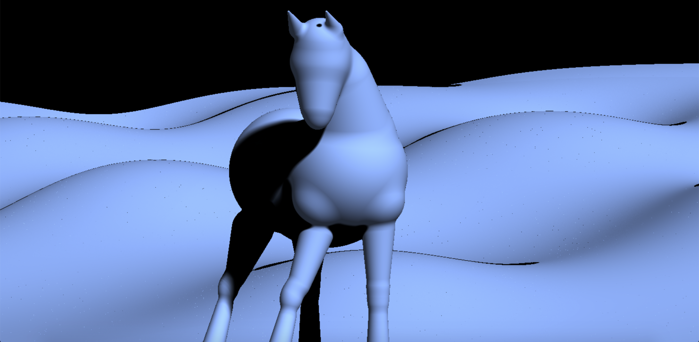
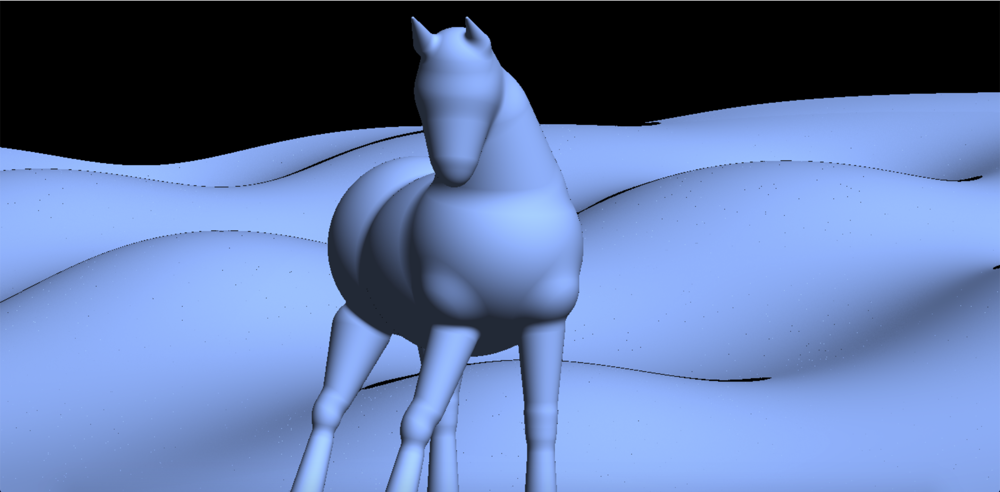
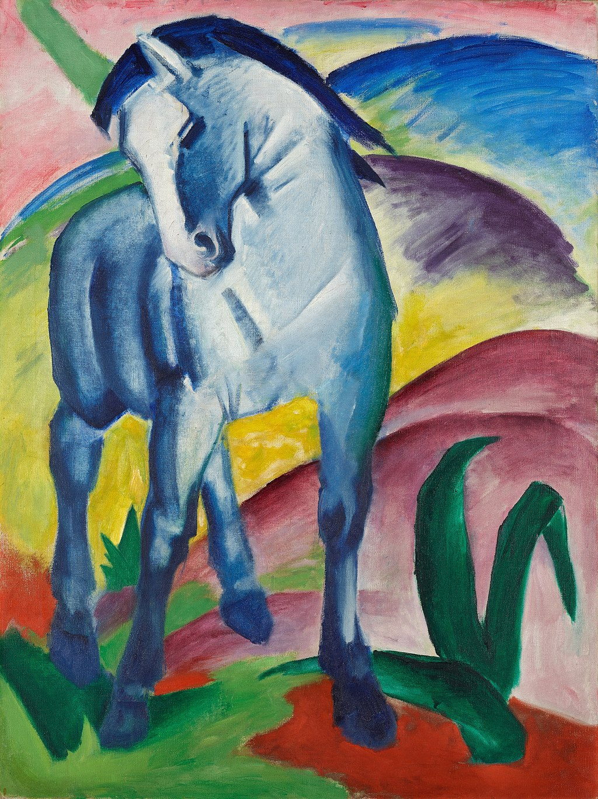

# CIS 566 Homework 2: Implicit Surfaces
By Meggie Cheng (PennKey: meggie)

## Result
Link to live demo (currently not working): https://tauntybird.github.io/hw02-raymarching-sdfs/

My render with soft shadows:

My render without shadows:

## Explanation
- For the model, I utilized many sphere, ellipsoid, round cone, and capped cone SDFs. I also used a plane SDF with displacement for the background hills. The horse's SDFs are all smooth min'd together, and many of the parts are reused and translated by an offset (notably the legs but also the ears, and chest and hindquarters).
- For the animation, I animated the background (rolling hills). Time and space are both displaced by sin and cos functions, and the rate at which the time is displaced is further modified with a quadratic easing function.
- There is one source of light in the scene and it is blue-ish, thus casting everything in the scene as blue for now. Both soft and hard shadows are implemented, you just need to modify a defined variable at the top of the frag file to show one or the other. There are similar controls for turning on/off animation or shadows completely.
- Tip: since I didn't optimize/clean up my code yet, feel free to temorarily comment out the horse to see the background animation, or vice versa to be able to rotate around the horse and see it at multiple angles with slightly higher fps.

## Reference art
Blue Horse I by Franz Marc

(https://en.wikipedia.org/wiki/Blue_Horse_I)

## Helpful resources
- IQ's SDF functions: https://www.iquilezles.org/www/articles/distfunctions/distfunctions.htm
- IQ's shadertoy, Mike: https://www.shadertoy.com/view/MsXGWr
- IQ's soft shadows: https://www.iquilezles.org/www/articles/rmshadows/rmshadows.htm
