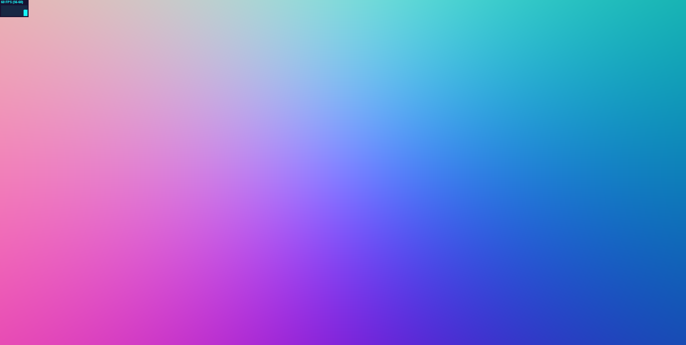

# CIS 566 Homework 2: Implicit Surfaces

## Objective
- Gain experience with signed distance functions
- Experiment with animation curves

## Base Code
The code we have provided for this assignment features the following:
- A square that spans the range [-1, 1] in X and Y that is rendered with a
shader that does not apply a projection matrix to it, thus rendering it as the
entirety of your screen
- TypeScript code just like the code in homework 1 to set up a WebGL framework
- Code that passes certain camera attributes (listed in the next section),
the screen dimensions, and a time counter to the shader program.

## Assignment Requirements
- __(10 points)__ Modify the provided `flat-frag.glsl` to cast rays from a
virtual camera. We have set up uniform variables in your shader that take in
the eye position, reference point position, and up vector of the `Camera` in
the provided TypeScript code, along with a uniform that stores the screen width
and height. Using these uniform variables, and only these uniform variables,
you must write a function that uses the NDC coordinates of the current fragment
(i.e. its fs_Pos value) and projects a ray from that pixel. Refer to the [slides
on ray casting](https://docs.google.com/presentation/d/e/2PACX-1vSN5ntJISgdOXOSNyoHimSVKblnPnL-Nywd6aRPI-XPucX9CeqzIEGTjFTwvmjYUgCglTqgvyP1CpxZ/pub?start=false&loop=false&delayms=60000&slide=id.g27215b64c6_0_107)
from CIS 560 for reference on how to cast a ray without an explicit
view-projection matrix. You'll have to compute your camera's Right vector based
on the provided Up vector, Eye point, and Ref point. You can test your ray
casting function by converting your ray directions to colors using the formula
`color = 0.5 * (dir + vec3(1.0, 1.0, 1.0))`. If your screen looks like the
following image, your rays are being cast correctly:

- __(70 points)__ Create and animate a scene using signed distance functions.
The subject of your scene can be anything you like, provided your scene includes
the following elements:
  - The SDF combination operations Intersection, Subtraction, and Smooth Blend
  - Raymarch optimization by way of bounding volumes around SDFs, arranged in
  a Bounding Volume Hierarchy
  - Animation of at least two scene attributes such as color, position, scale,
  twist, rotation, texture, or anything else you can think of
  - At least two functions mentioned in the Toolbox Functions slides used for
  animation
  - Procedural texturing using toolbox functions and/or noise functions
  - Shading that involves surface normal computation

- __(10 points)__ Add GUI elements via dat.GUI that allow the user to modify at
least two different attributes of your scene.

- __(10 points)__ Following the specifications listed
[here](https://github.com/pjcozzi/Articles/blob/master/CIS565/GitHubRepo/README.md),
create your own README.md, renaming this file to INSTRUCTIONS.md. Don't worry
about discussing runtime optimization for this project. Make sure your
README contains the following information:
  - Your name and PennKey
  - Citation of any external resources you found helpful when implementing this
  assignment.
  - A link to your live github.io demo (refer to the pinned Piazza post on
    how to make a live demo through github.io)
  - An explanation of the techniques you used to generate your planet features.
  Please be as detailed as you can; not only will this help you explain your work
  to recruiters, but it helps us understand your project when we grade it!

## Useful Links
- [IQ's Article on SDFs](http://www.iquilezles.org/www/articles/distfunctions/distfunctions.htm)
- [IQ's Article on Smooth Blending](http://www.iquilezles.org/www/articles/smin/smin.htm)
- [IQ's Article on Useful Functions](http://www.iquilezles.org/www/articles/functions/functions.htm)
- [Breakdown of Rendering an SDF Scene](http://www.iquilezles.org/www/material/nvscene2008/rwwtt.pdf)

## Submission
Commit and push to Github, then submit a link to your commit on Canvas. Remember
to make your own README!

## Inspiration
- [Alien Corridor](https://www.shadertoy.com/view/4slyRs)
- [The Evolution of Motion](https://www.shadertoy.com/view/XlfGzH)
- [Fractal Land](https://www.shadertoy.com/view/XsBXWt)
- [Voxel Edges](https://www.shadertoy.com/view/4dfGzs)
- [Snail](https://www.shadertoy.com/view/ld3Gz2)
- [Cubescape](https://www.shadertoy.com/view/Msl3Rr)
- [Journey Tribute](https://www.shadertoy.com/view/ldlcRf)
- [Stormy Landscape](https://www.shadertoy.com/view/4ts3z2)
- [Generators](https://www.shadertoy.com/view/Xtf3Rn)

## Extra Credit (20 points maximum)
- __(5 - 20 pts)__ Do some research into more advanced shading techniques such
as ambient occlusion, soft shadows, GGX materials, depth of field, volumetrics,
etc. and implement one of them. The more complex your feature, the more points
you'll earn.
- __(? pts)__ Propose an extra feature of your own!
