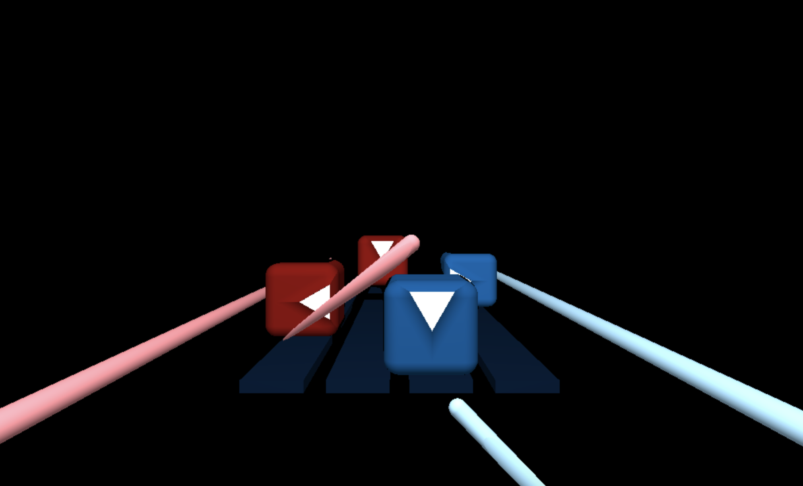

# CIS 566 Homework 2: Implicit Surfaces

## Objective

- Gain experience with signed distance functions
- Experiment with animation curves

## Techniques

part1: 

- casted rays from a virtual camera
- tested the ray casting function by converting ray directions to colors using the formula `color = 0.5 * (dir + vec3(1.0, 1.0, 1.0))`

part2: 

- Used SDF smoothunion and intersection to make beat cubes and light sabers
- Used ease-in, sin, and cos functions to control the animations

## General Information

Name: Amelia Peng

PennKey: pqy

Live Demo: https://ameliapqy.github.io/hw02-raymarching-sdfs/

Resources:

- https://www.iquilezles.org/www/articles/distfunctions/distfunctions.htm
- https://www.iquilezles.org/www/articles/smin/smin.htm
- https://www.shadertoy.com/view/fsdXzM
