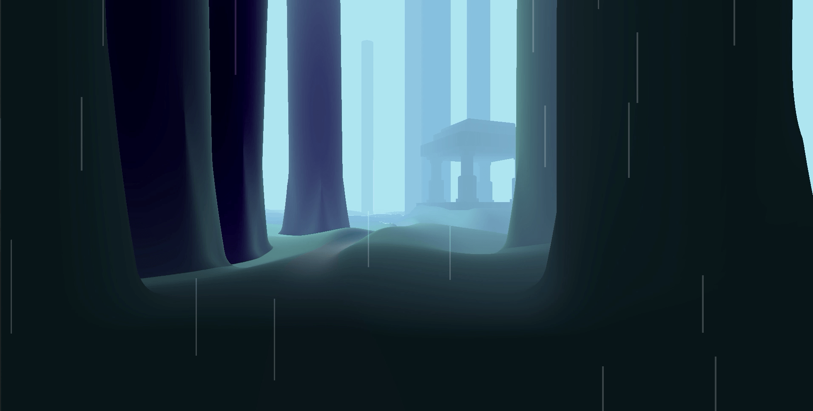
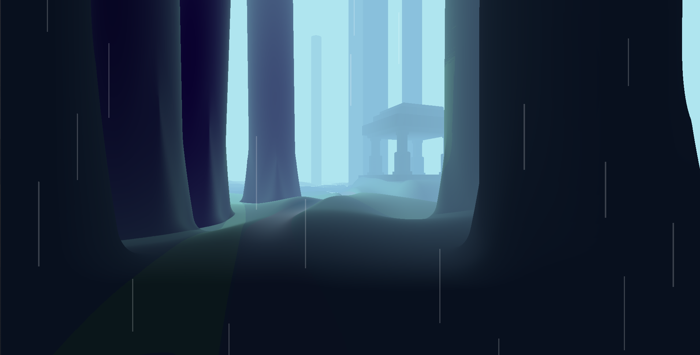
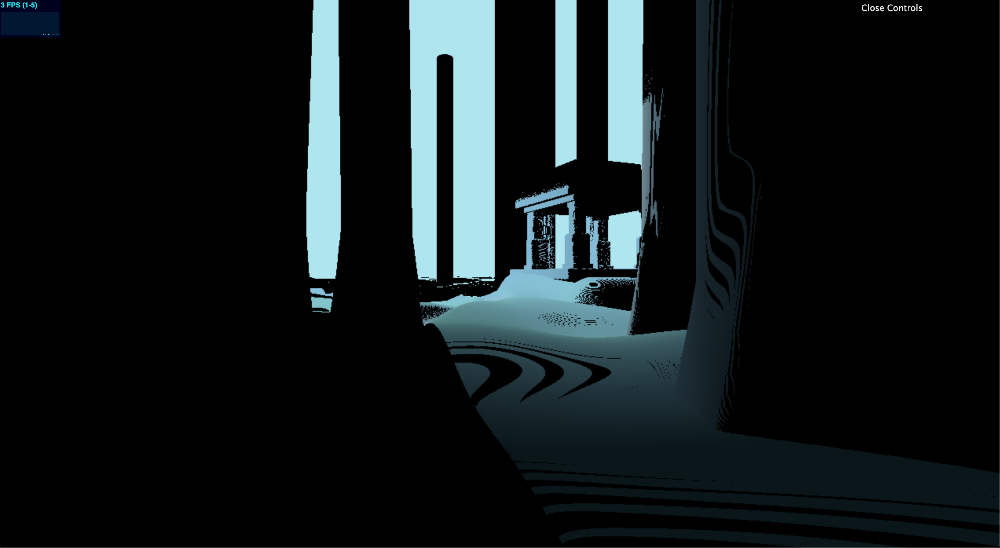
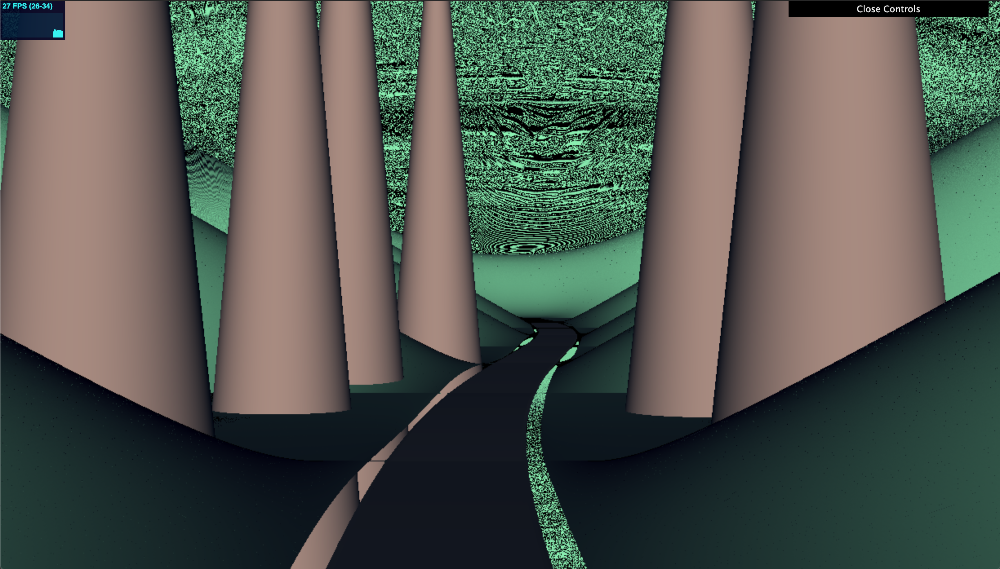
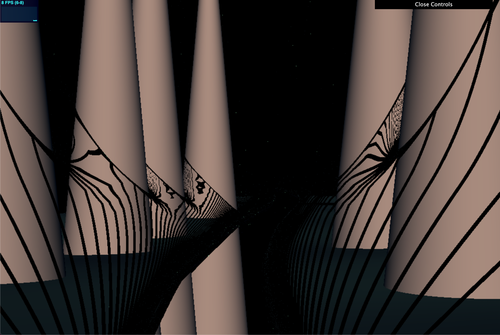
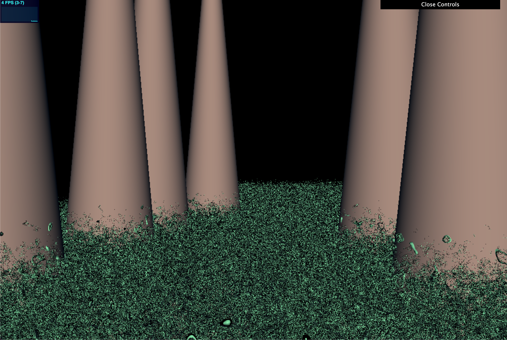

# CIS 566 Homework 2: Implicit Surfaces

In this project, I aimed to create a raymarched scene, replicating a screenshot from Sky: Children of Light by thatgamecompany.

### Demo / Installation 
Live demo: https://asalexan.github.io/hw02-raymarching-sdfs/

To run locally:
1. Clone this repo
2. run `npm i`
3. run `npm start`

### Process
I first started with a markup of the screenshot I wanted to replicate, which you can see below:

In order to produce the initial geometry and lambertian shading, I added the following elements:
- **Forest SDF:** I created a ForestSDF, which places trees (composed of TreeSDFs) in the scene given a list of Tree structs with varying positions, radii, and heights. The trees themselves are cylinders smoothblended with cones at the bases. 
- **Temple SDF:** The TempleSDF is composed of columns, a base, and a roof. There is one ColumnSDF, which is reflected across the x and z axes by taking the absolute value of the input point, creating four symmetric columns. The rest of the temple is built out of rounded box SDFs. 
- **Terrain Height Field:** I created a function f(x, z) that returns a height to be compared against the query point y. The ground is deformed with perlin noise to create hills, and the path is just a sine wave. If the query point resides close to or inside the path in the x direction, it's colored appropriately, and the height is interpolated down to a flat terrain height.  
- **Distance Fog:** There are two different color interpolations done according to z-distance. The first (closest) is interpolation between the lambert color and the blue fog color. The second, for farther objects, is interpolation between alpha 1.0 and alpha 0.0 to simulate objects fading into the distance.
- **Hard Shadows:** Hard shadows are produced by shadow feeler rays cast toward the sky light source (behind the trees on the left side). Since they make the animation too slow, they're not in the demo, but you can see a screenshot of these below.

### Resources
I used the following resources as reference:

[SDFs, SDF Symmetry](https://www.iquilezles.org/www/articles/distfunctions/distfunctions.htm)
[Height Fields](
### Bloopers

