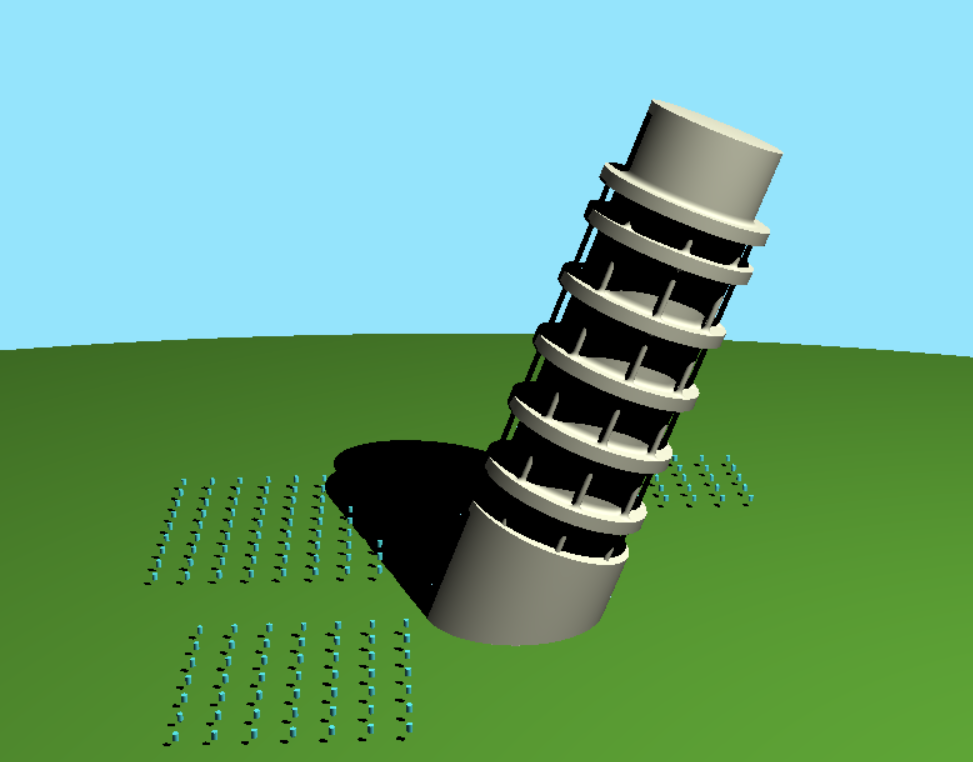

# Leaning Tower of Pisa - SDF Recreation

By An Duong

Pennkey: onlyname

## Overview
* **Leaning Tower of Pisa Recreation**

* **Inspiration**

[Live Demo](https://onlyname1.github.io/hw02-raymarching-sdfs/)

## Implementation
The Tower of Pisa was recreated using a fragment shader that rendered the scene through raymarched signed distance functions. The scene also includes basic Lambertian reflection, hard shadows implemented via raymarched shadow feeler rays, as well as basic materials. The tower is made up of the smooth blend and union of SDF cylinders. The floors of the tower were created using the repetition of a singular floor through the SDF limited modullo function. The tower leans over time via a sine function. The crowds of people were also created by repeating an SDF cylinder over an area. The crowds jump up and down by offsetting their position with a triangle wave function dependent on time and a specific person's position.

## Citations
[Useful SDF Transformations](http://jamie-wong.com/2016/07/15/ray-marching-signed-distance-functions/#rotation-and-translation)

<<<<<<< HEAD
[SDF Functions](https://www.iquilezles.org/www/articles/distfunctions/distfunctions.htm)
=======
[SDF Functions](https://www.iquilezles.org/www/articles/distfunctions/distfunctions.htm)
>>>>>>> d6d1f4369c6f85aa7c0591fc6ca457dd133f45f7
